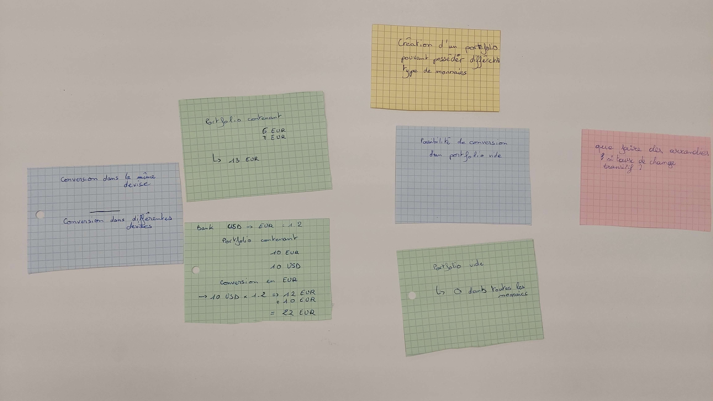

# Example Mapping


- Commencer par écrire la *User Story* à affiner (sur un post-it jaune) et la placer au centre de la table
- Ensuite, écrire chaque critère d'acceptation ou règle métier existante sur un post-it bleu et les placer sous celui de la User Story.
- Pour chaque règle, nous avons besoin d'un ou plusieurs exemples pour les illustrer. Les écrire sur des post-it verts et les placer sous la règle correspondante.
- En échangeant sur ces exemples, vous pouvez découvrir des questions pour lesquelles personne autour de la table ne peut répondre : les écrire sur des post-it rouges et continuer la conversation. 

## Format de restitution



### Création d'un portefolio pouvant contenir différents type de monnaies

> Que faire des arrondis si taux de change transitif ?
 
#### Conversion dans la même devise

```
6 EUR + 7 EUR = 13 EUR
```

#### Conversion dans une autre devise

```
Bank => USD -> EUR = 1.2
10 EUR + 10 USD

10 USD x 1.2 = 12 EUR
12 EUR + 10 EUR = 22 EUR
```

### Conversion d'un portfolio vide

```
0 = 0 dans toutes les devises
```

### Conversion de monnaie différente sans taux de change

```
Bank => ()
10 Eur
10 USD

Expect Portfolio Error > Portfolio has not the exchange rate
```