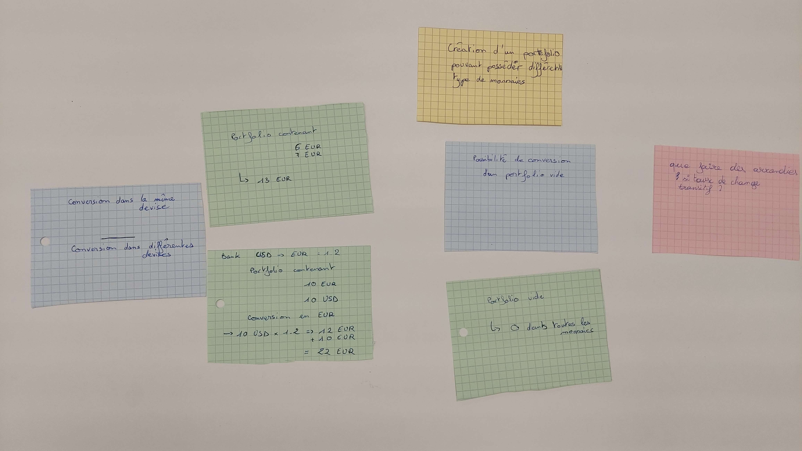

# Example Mapping

Prendre quelques instants pour lire à propos de l'[Example Mapping](https://xtrem-tdd.netlify.app/Flavours/example-mapping).

## Spécifications

Nous souhaitons pouvoir gérer des opérations entre montants de différentes devises.

Exemples :
- [ ] 5 USD + 10 EUR = 17 USD
- [ ] 1 USD + 1100 KRW = 2200 KRW

Nous avons besoin d'apporter un nouveau concept métier à notre code : un portefeuille (`Portfolio`).

Un portefeuille contient une **liste de montants de différentes devises**.

En prenant le premier exemple ci-dessus, il contiendrait `5 USD` et `10 EUR`.

Nous devons être capables d'**évaluer** le montant total du portefeuille, dans une **devise donnée** :
- `USD` => `17 USD`
- `EUR` => `14,1 EUR`
- `KRW` => `18940 KRW`
- etc.

En d'autres termes :

```gherkin
Given a portfolio containing an amount in a currency A
  And an amount in a currency B
  And a Bank with exchange rate between currency A and currency B
When I evaluate the portfolio to the Bank in currency A
Then I should receive the evaluated amount in currency A
```

### User Story

```gherkin
As a Bank Customer
I want to be able to add money in a portfolio
So that I can evaluate the total amount in a currency
```

### Ubiquitous Language

**Portfolio** : aggrégation de montants dans différentes devises.


## Example mapping


- Commencer par écrire la *User Story* à affiner (sur un post-it jaune) et la placer au centre de la table
- Ensuite, écrire chaque critère d'acceptation ou règle métier existante sur un post-it bleu et les placer sous celui de la User Story.
- Pour chaque règle, nous avons besoin d'un ou plusieurs exemples pour les illustrer. Les écrire sur des post-it verts et les placer sous la règle correspondante.
- En échangeant sur ces exemples, vous pouvez découvrir des questions pour lesquelles personne autour de la table ne peut répondre : les écrire sur des post-it rouges et continuer la conversation. 

## Format de restitution



### Création d'un portefolio pouvant contenir différents type de monnaies

> Que faire des arrondis si taux de change transitif ?
 
#### Conversion dans la même devise

```
6 EUR + 7 EUR = 13 EUR
```

#### Conversion dans une autre devise

```
Bank => USD -> EUR = 1.2
10 EUR + 10 USD

10 USD x 1.2 = 12 EUR
12 EUR + 10 EUR = 22 EUR
```

### Conversion d'un portfolio vide

```
0 = 0 dans toutes les devises
```